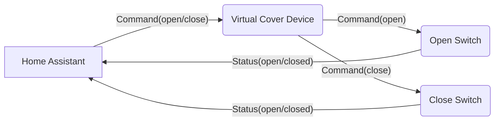
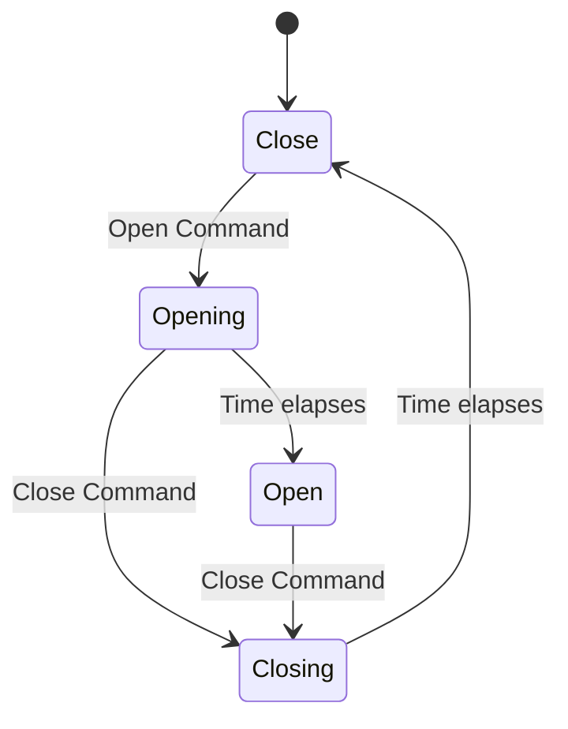
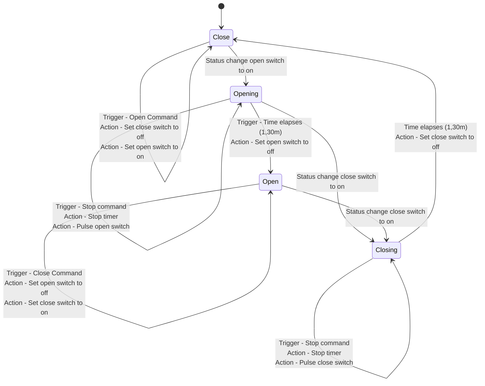

# Virtual Cover Device for Home Assistant

## Project Purpose

This project implements a virtual cover device designed for integration with Home Assistant. The application leverages the MQTT protocol to interact with Home Assistant, enabling control and status reporting for a virtual cover entity.

The core functionality of the virtual cover device is to:

1.  **Receive Commands:** Listen for commands from Home Assistant to open or close the virtual cover as well as from the switches that are also reporting
in a different topic.
2.  **Publish Commands:** Send commands to virtual switches to simulate the open/close actions.
3.  **Report Status:** Update Home Assistant with the status of the virtual switches (open/closed).

## Components

The virtual cover device consists of the following components:

1.  **Virtual Cover Device:** The central application that:
    *   Receives commands (open/close) from Home Assistant via MQTT.
    *   Publishes commands to virtual switches via MQTT.
2.  **Virtual Switches (2):** Two virtual switches, one for opening and one for closing the cover.
    * The switches will change their status when the virtual cover sends a message, this app will process and send to the appropriate topic depending on the switch.
    *   Each switch will publish its status (open/close) via MQTT.
3. **Home Assistant:**
   * The home automation platform that sends commands to the virtual cover.
   * Receives status messages from the virtual switches.

## MQTT Interaction

The application interacts with MQTT, responding to specific topics and publishing commands via MQTT messages. The specific topics used are defined within the application.

## Interaction Diagram

Here's a simple diagram illustrating the interaction between the components:

**Explanation of the Diagram**

* Home Assistant send a command to the virtual cover device.
* Virtual cover device sends a command to one of the switches.
* The switches will update their status and publish this to home assistant.

## State Diagram

In a simplified way the state transition in the VCD is as follows:



There are two different ways to get the Open or Close commands, either from Home Assistant or from the switches themselves.
* From Home Assistant it will be received in the COVER_COMMAND.
and processed as a command to the switches in the corresponding topic.
* From the switches it will be received in the SWITCH_OPEN_STATE or SWITCH_CLOSE_STATE and processed as a state change to the virtual cover in 
the COVER_STATE topic.

## Complete transitions

In order to implement the full state machine the transitions to follow are:



## Getting Started

To run the application, follow these steps:

1.  Ensure you have Rust and Cargo installed.
2.  Clone the repository:
```
bash
    git clone [repository url]
    
```
3.  Navigate to the project directory:
```
bash
    cd [project directory]
    
```
4.  Run the project
```
bash
    cargo run
    
```
## Future Improvements

*   Error handling and logging improvements.
*   Add support for more complex cover functionalities, such as setting a specific position.
*   Implement an external configuration.